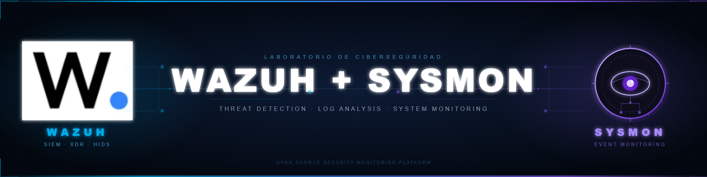

# laboratorio-soc-wazuh-sysmon
Laboratorio SOC con Wazuh + Sysmon para detección y análisis de técnicas MITRE ATT&amp;CK en un endpoint Windows. Incluye simulación de fuerza bruta, ejecución de PowerShell malicioso, ofuscación Base64, creación de payloads temporales y detección de DLL Search Order Hijacking. Telemetría avanzada con Sysmon y correlación de alertas en Wazuh.
